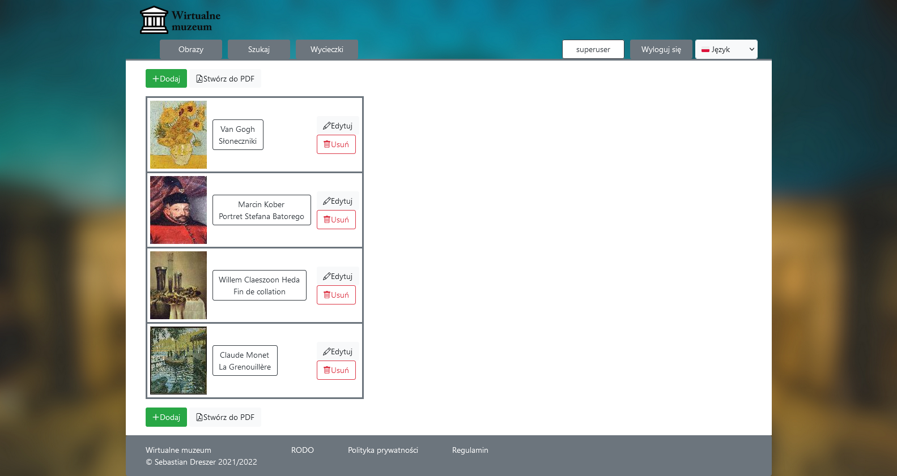
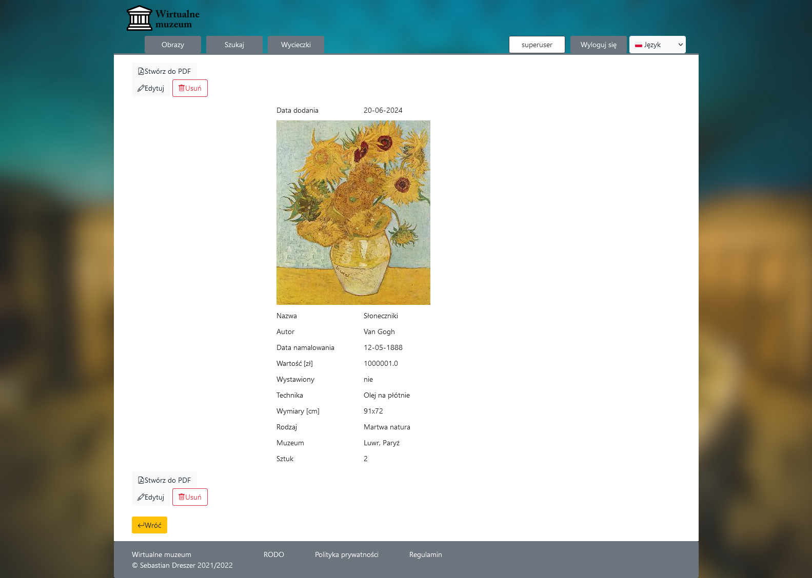
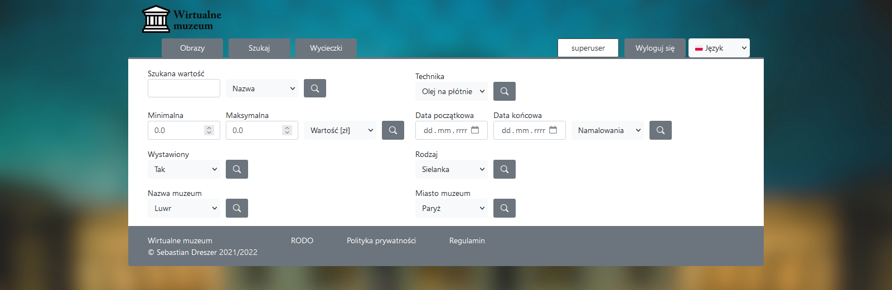
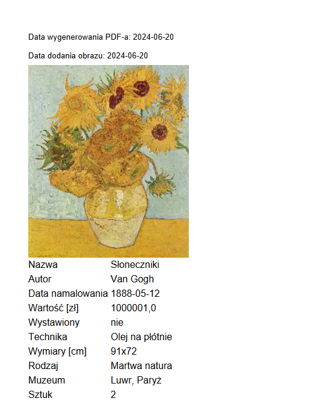

# PL

# Wirualne muzeum

Serwis internetowy do zarządzania obrazami i organizowania wycieczek 
Napisane w Spring Boot i Thymeleaf w IntelliJ Idea.
Bazą danych jest PostgeSQL, ale do celów debugowania używana jest H2 „w pamięci”. 
Listopad 2021 - Styczeń 2022

### Jeśli obrazy się nie wyświetlają, należy zaktualizować ścieżkę w pliku config.properties!

# EN

# Virtual museum

Web service to manage paintings and organize trips.  Written in Spring Boot and Thymeleaf in IntelliJ Idea.
Database is PostgreSQL, but to debugging purpose is using H2 in-memory. 
November 2021 - January 2022

### If images is not visible, you should update path in config.properties!

Lista obrazów 
Paintings list 

Ta sama lista po angielsku 
This same list in English 

Szczegóły obrazu 
Painting details 

Strona wyszukiwania 
Search page 

Wygenerowany PDF 
Generated PDF 
