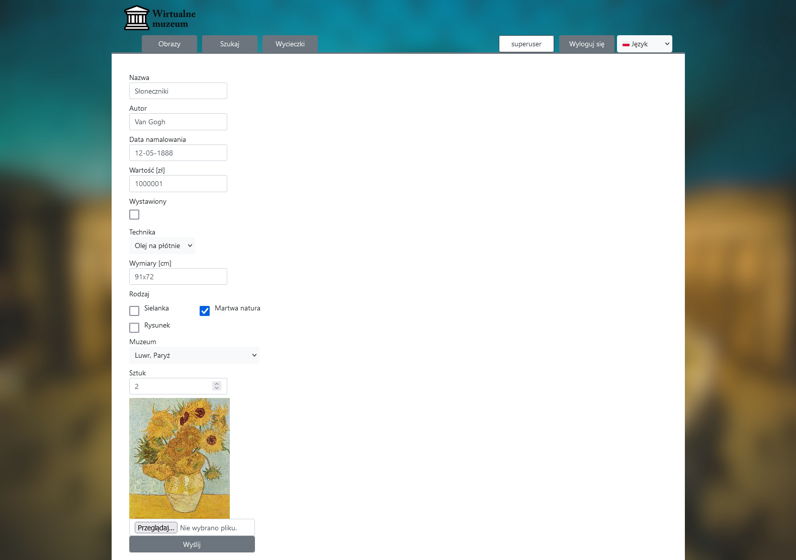
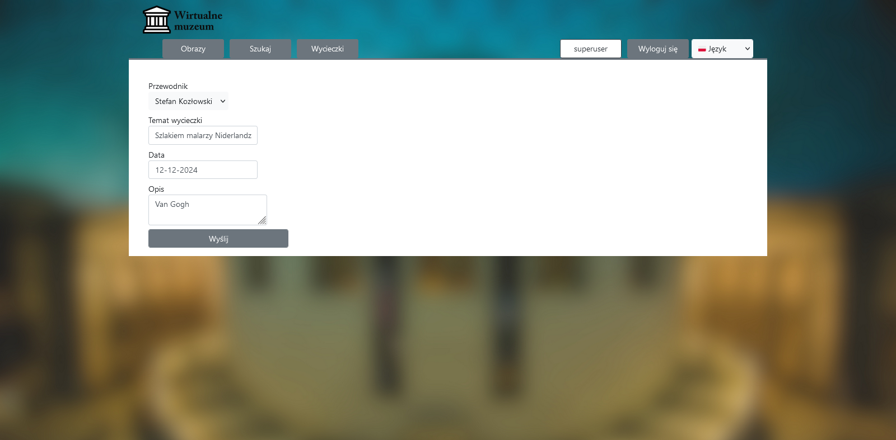
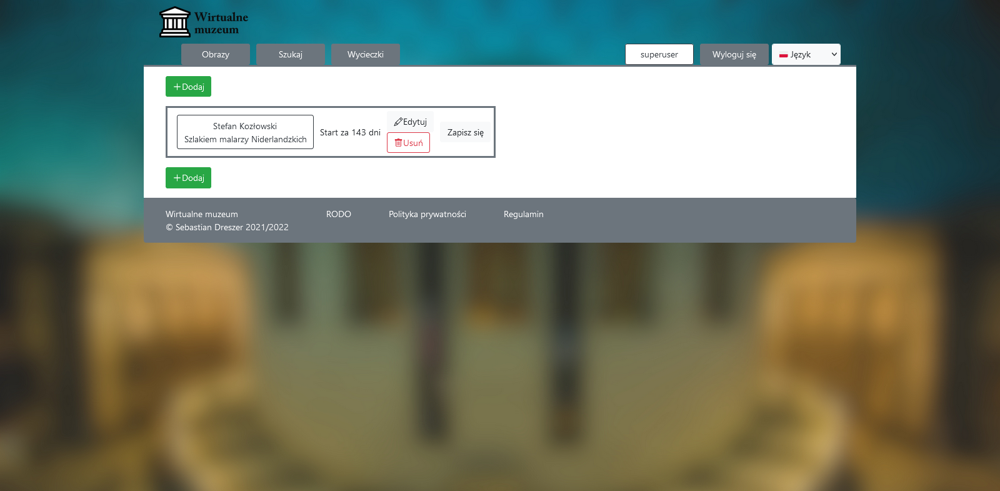
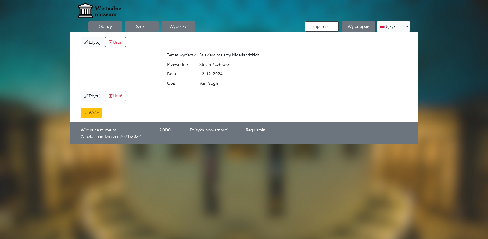

# PL

# Wirtualne muzeum

**Technologie** 
Java + Spring Boot, Lombok, iTextPdf 
Thymeleaf, Bootstrap,
PostgreSQL, H2, Hibernate 

Aplikacja internetowa będąca wirtualnym muzeum obrazów. Dodatkową funkcją jest możliwość umieszczania wycieczek
odbywających się w
rzeczywistych muzeach.  
Poza standardowym CRUD-em obrazów i wycieczek, aplikacja umożliwia wygenerowanie PDF-a z przeglądanego obrazu (a także
wszystkich na raz).  
Witryna zawiera dodatkowo wyszukiwarkę, która umożliwia określenie wielu warunków filtrowania.  
Bazą danych jest PostgreSQL, ale do celów debugowania używana jest H2 „w pamięci”. 

**Dane logowania** login: `admin`, hasło: `admin`

**Uruchomienie** 
Uruchomienie z IntelliJ Idea na podstawie konfiguracji z folderu .run wydaje się łatwiejsze. 
Pozostanie po tym tylko instalacja bazy i aktualizowanie ścieżek (kroki 5-6 i 12-15).

1. Pobieramy `virtual_museum.war` z https://drive.google.com/file/d/1pVfuNy1RSFGCDQab806B4K4c4NtyTef5/view?usp=sharing
   (plik jest za duży dla GitHuba)
2. Pobieramy SDK Javy
3. Ustawiamy zmienną środowiskową `JAVA_HOME` (jeśli sama się nie ustawiła)  
   3.1 Otwieramy okno `Ten komputer`  
   3.2 Prawy klik na pustą przestrzeń (tzn. nie ikonę). Z menu wybieramy `Właściwości`  
   3.3 Po lewej `Zaawansowane ustawienia systemu`  
   3.4 Zakładka `Zaawansowane` a w niej na dole przycisk `Zmienne środowiskowe`  
   3.5 Grupa `Zmienne systemowe` -> `Nowa`  
   3.6 Nazwa zmiennej: `JAVA_HOME`  
   3.7 Wartość zmiennej: lokalizacja instalacji SDK np. `C:\Users\<użytkownik>\.jdks\openjdk-22.0.1`  
   3.8 Naciskamy `OK` we wszystkich okienkach.  
   3.9 Może być konieczny restart komputera.  
4. Pobieramy i instalujemy Tomcata (może być z XAMPP-a).
5. Pobieramy i instalujemy PostgreSQL.  
   5.1 Podczas instalacji zaznaczamy pgAdmin, będzie łatwiej stworzyć bazę.  
   5.2 Podczas tworzenia użytkownika wpisujemy nazwę użytkownika `postgres` a hasło `superuser`. 
   Jeśli będzie inne, trzeba będzie zmienić w aplikacji (punkt 12)
6. Konfiguracja bazy  
   6.1 Uruchamiamy `<lokalizacja PostgreSQL>\pgAdmin 4\runtime\pgAdmin4.exe`  
   6.2 Po lewej, w `Object Explorer`, rozwijamy: `Servers->PostgreSQL <wersja>->Databases`  
   6.3 Prawy klik na `Databases->Create->Database…`  
   6.4 W polu Database wpisujemy `virtual_museum` i naciskamy `OK`.  
   6.5 Zamykamy pgAdmina
7. Umieszczamy `virtual_museum.war` w `<lokalizacja Tomcata>/webapps`
8. Teraz w `<lokalizacja Tomcata>/bin` uruchamiamy wiersz polecenia
9. Wpisujemy `catalina.bat run`. Uruchomi to serwer Tomcata a razem z nim aplikację.
10. Aplikacja powinna być pod adresem http://localhost:8080/virtual_museum
11. Niestety wymaga jeszcze konfiguracji :(
12. Jeśli zostały ustawione inne dane logowania do bazy niż podane w kroku 5.2:  
    12.1 Nawigujemy do `<lokalizacja Tomcata>/webapps/virtual_museum/WEB-INF/classes` 
    (jeśli nie ma folderu `virtual_museum`, uruchom Tomcata jeszcze raz)  
    12.2 Edytujemy `application.properties`  
    12.3 `spring.datasource.username=` odpowiada za użytkownika (linia 9)  
    12.4 `spring.datasource.password=` odpowiada za hasło (linia 10)
13. Jeśli nazwa bazy, url lub port jest inny niż domyślny  
    13.1 Lokalizacja i plik jak punkt 12, z tym że linijka 8:  
    13.2 `spring.datasource.url=jdbc:postgresql://<url>:<port>/<nazwa_bazy>`
14. Należy zmienić ścieżkę dostępu do plików  
    14.1 Nawigujemy do `<lokalizacja Tomcata>/webapps/virtual_museum/WEB-INF/classes`  
    14.2 Edytujemy `config.properties`
15. Zmieniamy 3 pierwsze linijki  
    15.1 `files.location=<lokalizacja Tomcata>/webapps/virtual_museum/WEB-INF/classes/static/images`  
    15.2 `fonts.location=<lokalizacja Tomcata>/webapps/virtual_museum/WEB-INF/classes/static/fonts`  
    15.3 `pdfs.location=`ścieżka może być dowolna, aby istniała na komputerze.  
    15.4 Kolejne linie w pliku zmieniamy, jeśli numer portu Tomcata jest inny niż 8080
16. Aplikacja jest skonfigurowana i gotowa do klikania.  
    (szkoda tylko, że więcej czasu zajęło uruchamianie, niż klikanie w niej ;) )

Listopad 2021 - styczeń 2022

# EN

# Virtual museum

**Technologies** 
Java + Spring Boot, Lombok, iTextPdf 
Thymeleaf, Bootstrap,
PostgreSQL, H2, Hibernate 

Internet application who is paintings virtual museum. Extra function is a possibility write information about trips in
real museums.  
Besides standard paintings and trips CRUDs, application allow generating PDF-a from previewed painting (and from all
paintings in one time).  
Website extra contains searcher, which makes it possible to define many filters conditions.  
Database is PostgreSQL, but to debugging is using H2 "in memory". 

**Login data** login: `admin`, password: `admin`

**Launching** 
Launching from IntelliJ Idea on base configuration from .run folder seems easier. 
This will leave only base installation and path updates (steps 5-6 and 12-15).

1. Download from `virtual_museum.war`
   from https://drive.google.com/file/d/1pVfuNy1RSFGCDQab806B4K4c4NtyTef5/view?usp=sharing (file is too big for GitHub)
2. Download Java SDK
3. Set environment variable `JAVA_HOME` (if not set automatically)  
   3.1 Open window `This PC`  
   3.2 Right click on empty space (that's mean. not icon). From menu choose `Properties`  
   3.3 Click located on the left side `Advanced system's settings`  
   3.4 Tab `Advanced`, next button on bottom `Environment Variables`  
   3.5 Group `System variables` -> `New`  
   3.6 Variable name: `JAVA_HOME`  
   3.7 Variable value: SDK install localization ex. `C:\Users\<user>\.jdks\openjdk-22.0.1`  
   3.8 Press `OK` in all windows.  
   3.9 You may need to restart a computer.  
4. Download and install Tomcat (can be from XAMPP).
5. Download and install PostgreSQL.  
   5.1 During installation check pgAdmin, to easier database creating.  
   5.2 During user creating enter username `postgres` password `superuser`. 
   If other, you must change later in application (step 12)
6. Base configuration  
   6.1 Run `<PostgreSQL localization>\pgAdmin 4\runtime\pgAdmin4.exe`  
   6.2 In left side, in `Object Explorer`, expand: `Servers->PostgreSQL <version>->Databases`  
   6.3 Right click on `Databases->Create->Database…`  
   6.4 In Database field enter `virtual_museum` and press `OK`.  
   6.5 Close pgAdmin
7. Place `virtual_museum.war` into `<Tomcat localization>/webapps`
8. Now in `<Tomcat localization>/bin` run command line
9. Enter `catalina.bat run`. This run Tomcat server with application.
10. Application should be on http://localhost:8080/virtual_museum
11. Unfortunaly, application need configuration :(
12. If you have set other login data for the database than that given in step 5.2:  
    12.1 Navigate to `<Tomcat localization>/webapps/virtual_museum/WEB-INF/classes` 
    (if `virtual_museum` folder doesn't exists, run Tomcat again)  
    12.2 Edit `application.properties`  
    12.3 `spring.datasource.username=` configure username (line 9)  
    12.4 `spring.datasource.password=` configure password (line 10)
13. If database mame, url or port is other than default  
    13.1 Localization and file just like step 12, but line 8:  
    13.2 `spring.datasource.url=jdbc:postgresql://<url>:<port>/<database_name>`
14. You must change files paths  
    14.1 Navigate to `<Tomcat localization/webapps/virtual_museum/WEB-INF/classes`  
    14.2 Edit `config.properties`
15. Change first 3 lines  
    15.1 `files.location=<Tomcat localization>/webapps/virtual_museum/WEB-INF/classes/static/images`  
    15.2 `fonts.location=<Tomcat localization>/webapps/virtual_museum/WEB-INF/classes/static/fonts`  
    15.3 `pdfs.location=`path can be any, but exist on computer.  
    15.4 Next lines changed if, port number is not equal 8080
16. Application is configured and ready to click.  
    (it's just a pity that it took more time to start up than to click on it ;) )  
     
    November 2021 - January 2022

Lista obrazów 
Paintings list 

Ta sama lista po angielsku 
This same list in English 

Szczegóły obrazu 
Painting details 

Edycja obrazu 
Painting editing 

Strona wyszukiwania 
Search page 

Wygenerowany PDF 
Generated PDF 

Edycja wycieczki  
Trip editing  

Lista wycieczek  
Trips list  

Szczegóły wycieczki  
Trip details  
